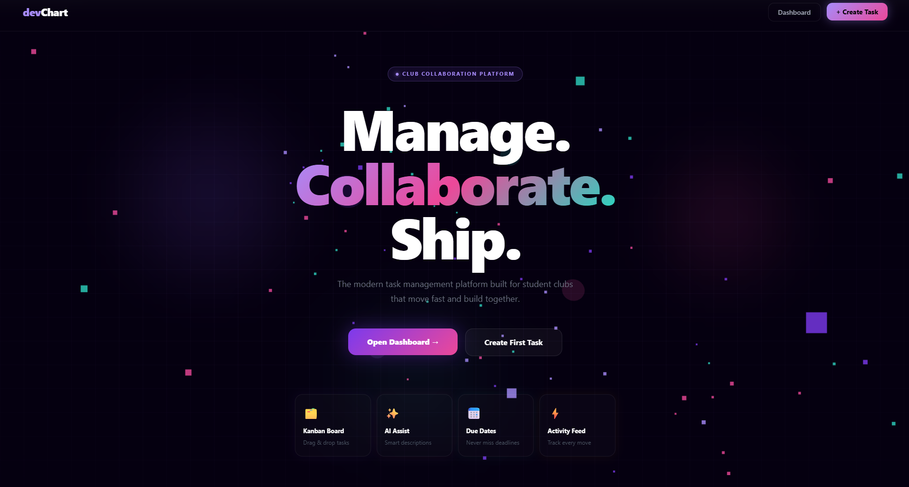
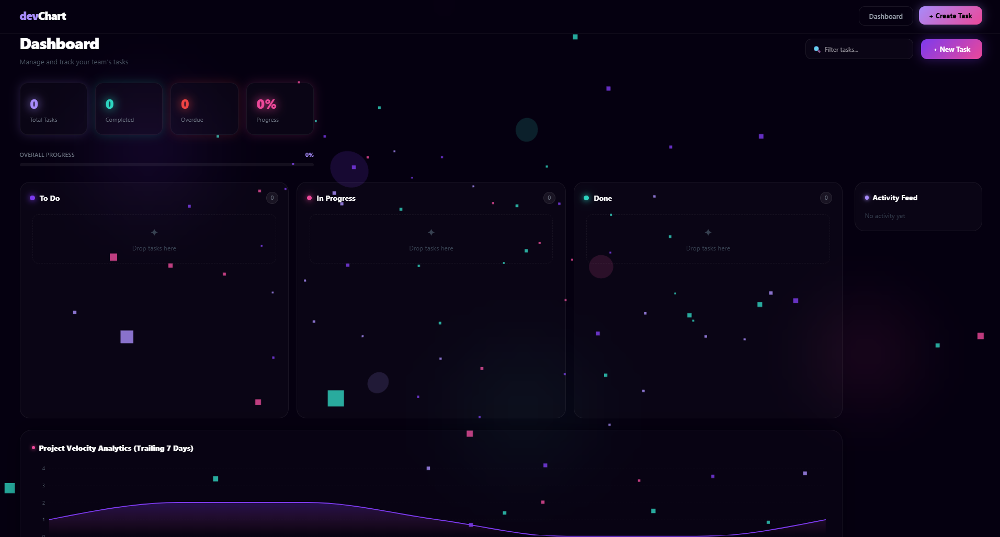
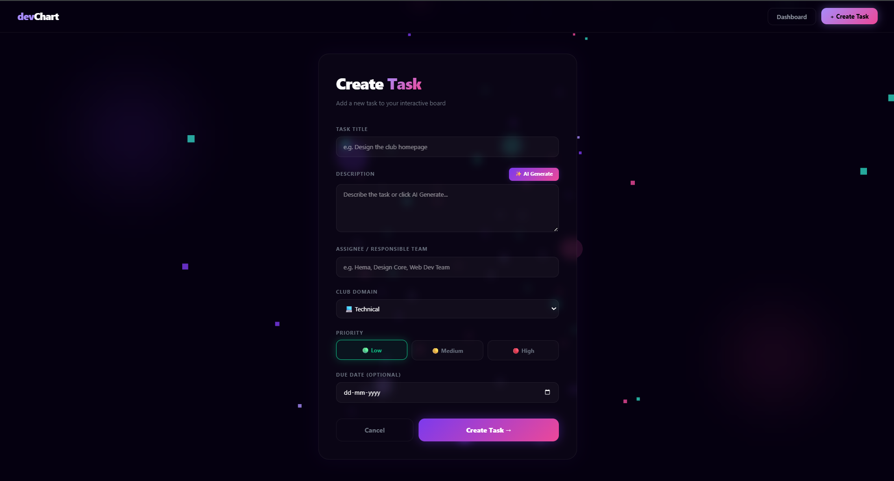
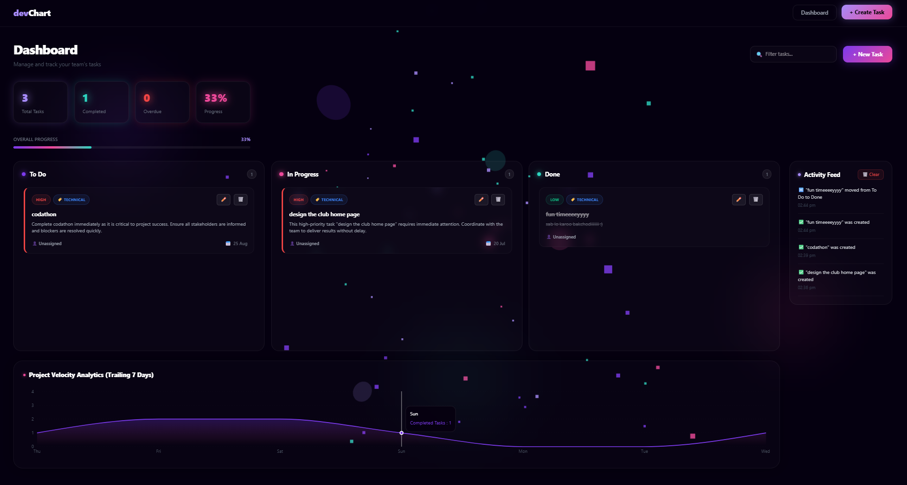

# devChart – Interactive Student Club Collaboration Platform

An advanced, full-stack Kanban workspace tailored specifically for fast-moving student organizations. Engineered to manage, distribute, and automate operational tasks across multiple technical and non-technical club departments seamlessly.

**🔗 Live Production URL:** [https://dev-chart-lac.vercel.app/](https://dev-chart-lac.vercel.app/)  
**📌 Target Submission:** Android Club Technical Recruitment 2026

---

## 🚀 Features Implemented

### 📋 1. Fluid Kanban Board Ecosystem
Converted a standard flat task display into a comprehensive, multi-lane management pipeline with automated tracking cards spanning `To Do`, `In Progress`, and `Done` phases.

### 🧠 2. Deep AI Task Synthesis Engine
Features an automated, real-time AI generation module built into the creation form. It uses context clues from the task title and priority values to instantly synthesize comprehensive execution parameters.

### 👥 3. Granular Collaboration & Assignee Auditing
Tracks task distribution seamlessly across specific individuals or core organizational teams. It ensures distinct responsibility assignments (e.g., specific student heads or specialized core divisions) directly alongside real-time updates.

### 🏷️ 4. Multi-Departmental Domain Tagging
Integrates modular tags to neatly isolate tasks across standard student club wings:
* `💻 Technical`
* `🎨 Design`
* `📊 Management`
* `📸 Media & Publicity`

### 📈 5. Project Velocity Analytics & Live Audit Feeds
Includes an interactive, beautiful data visualization node tracking aggregate team performance across a trailing 7-day scale. This is paired with an active, auto-updating operations feed logs and historical state transitions.

---

## 🛠️ Technology Stack Used

| Layer | Technology | Usage Details |
| :--- | :--- | :--- |
| **Frontend Framework** | Next.js (v14+) | App Router Architecture, Server Components, and client state isolation |
| **Language** | TypeScript | Strict component properties definitions, type safety across API integrations |
| **Styles & Theme** | Tailwind CSS | Premium glassmorphic design systems paired with global dark mode aesthetics |
| **Animation Engine** | Three.js / Canvas | Custom WebGL particle canvas engine handling real-time interactive background layers |
| **Database ODM** | MongoDB Atlas / Mongoose | Distributed persistent clusters tracking structured task schema fields securely |

---

## 🖥️ Screenshots of the Working Website

### 🌌 1. Landing Portal & WebGL Interaction View
The primary entryway featuring modern layout styling over an active Three.js canvas layer.



### 📊 2. Operational Kanban Dashboard
The control panel showcasing complete, live project analytics blocks, structural data grids, and empty task tracks.



### ✍️ 3. Intelligent Task Creation Form
The comprehensive input view highlighting the specialized field options for assignees, domain categories, and the integrated AI generation engine.



### ⚡ 4. Dynamic Production System in Action
A complete view of populated task cards embedded with high-contrast priority indicators, domain tags, assigned team members, and the updated activity history logs.



---

## ⚙️ Setup Instructions (Local Verification)

Follow these steps to deploy and run a secure validation build locally on your machine:

### 1. Repository Setup & Dependency Installation
```bash
# Clone your specific repository fork
git clone [https://github.com/your-username/devChart.git](https://github.com/your-username/devChart.git)
cd devChart

# Install the standardized project dependency matrix
npm install
2. Environment Variables Configuration
Create a .env.local file in your root folder and map your persistent cloud database handshake key string:

Code snippet
MONGODB_URI=mongodb+srv://<username>:<password>@cluster.mongodb.net/devchart?retryWrites=true&w=majority
3. Launch the Local Development Build
Bash
npm run dev
Open http://localhost:3000 inside your default browser window to preview and interact with your local setup.

📦 Deployment Instructions
The production pipeline is optimized for zero-overhead, serverless environments:

Database Persistence: Hosted on a global MongoDB Atlas shared cluster M0 layer, utilizing specific Mongoose backend validation criteria to handle multi-lane array updates securely.

Hosting Infrastructure: Managed via Vercel edge networks, configured with auto-deployment hooks triggered instantly on every git commit pushed to the production repository's main branch.

Environment Setup: Ensure that your persistent MONGODB_URI environment string matches your secure credentials inside your remote Vercel project management dashboard.

⚠️ Known Limitations & Architecture Roadmap
Single Tenant Club Focus: Currently engineered assuming a single unified student club workspace environment. The next version will feature next-gen Auth integrations (e.g., NextAuth/Clerk) to support completely isolated multi-tenant club workspaces.

Instant Client Refreshing: The active card update operations execute instant database operations. They currently rely on standard Next.js state updates and data revalidation to seamlessly sync changes across the UI.